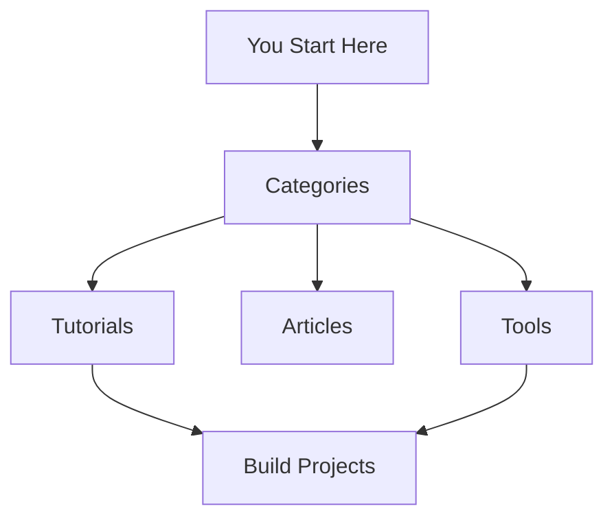

## Overview

Welcome to ACME Documentation, the home of the Abe Challah blog. You discover a vibrant space blending technology insights with entertainment. Explore tools that boost your productivity, in-depth articles on emerging tech, hands-on tutorials, and exclusive deals on gadgets. Launched to bridge tech innovation and pop culture passions—like sci-fi classics including ALIEN 8—this platform delivers engaging, practical content with a playful tone.

<Callout kind="info">
  Dive into content tailored for curious minds. Stay updated on the latest tools and trends.
</Callout>

## Content Categories

Abe Challah organizes content into key categories. You find everything from practical utilities to fun explorations.

<Columns cols={3}>
  <Card title="Tools" icon="zap" href="/tools">
    Productivity boosters and utilities. Test APIs, automate workflows, and integrate services seamlessly.
  </Card>

  <Card title="Articles" icon="book-open" href="/articles">
    Deep dives into tech trends and entertainment. Read analyses on AI advancements and sci-fi influences.
  </Card>

  <Card title="Tutorials" icon="code" href="/tutorials">
    Step-by-step guides. Build projects, configure setups, and master new skills.
  </Card>

  <Card title="Deals" icon="tag" href="/deals" horizontal>
    Curated discounts on tech gear. Save on hardware and software perfect for enthusiasts.
  </Card>
</Columns>

## Target Audience and Unique Features

You join a community of tech enthusiasts and pop culture fans. Unique features include humorous takes on complex topics, interactive tools, and crossover content—like coding Easter eggs inspired by movies.

<Tabs>
  <Tab title="Tech Enthusiasts" icon="cpu">
    Focus on practical tech. Access APIs for real-time data and automation scripts.

    <CodeGroup tabs="JavaScript,Python">
      ```javascript
      const response = await fetch('https://api.example.com/tools');
      const data = await response.json();
      console.log(data.tools);
      ```

      ```python
      import requests
      response = requests.get('https://api.example.com/tools')
      data = response.json()
      print(data['tools'])
      ```
    </CodeGroup>
  </Tab>

  <Tab title="Pop Culture Fans" icon="film">
    Entertainment with a tech twist. Explore articles linking sci-fi lore to modern gadgets.
  </Tab>
</Tabs>

## Get Started in Minutes

Follow these steps to explore Abe Challah effectively.

<Steps>
  <Step title="Browse Categories" icon="search">
    Navigate to tools, articles, tutorials, or deals using the sidebar.
  </Step>

  <Step title="Subscribe for Updates" icon="bell">
    Get RSS feeds or email alerts.

    ```bash
    # Add to your RSS reader
    curl https://abechallah.com/rss.xml
    ```
  </Step>

  <Step title="Try a Tool" icon="play">
    Pick a tutorial and run the sample code. Customize for your projects.
  </Step>
</Steps>

## Blog History and Advanced Tips

<ExpandableGroup>
  <Expandable title="Blog History" default-open="true">
    Abe Challah started as a personal project in 2020, evolving from tech notes to a full blog. You now access hundreds of posts blending utility with entertainment.
  </Expandable>

  <Expandable title="Pro Tips">
    Use search for specific topics. Bookmark favorites and share via social links.
  </Expandable>
</ExpandableGroup>



This setup ensures you navigate effortlessly while discovering value. Explore now and elevate your tech and entertainment experience.